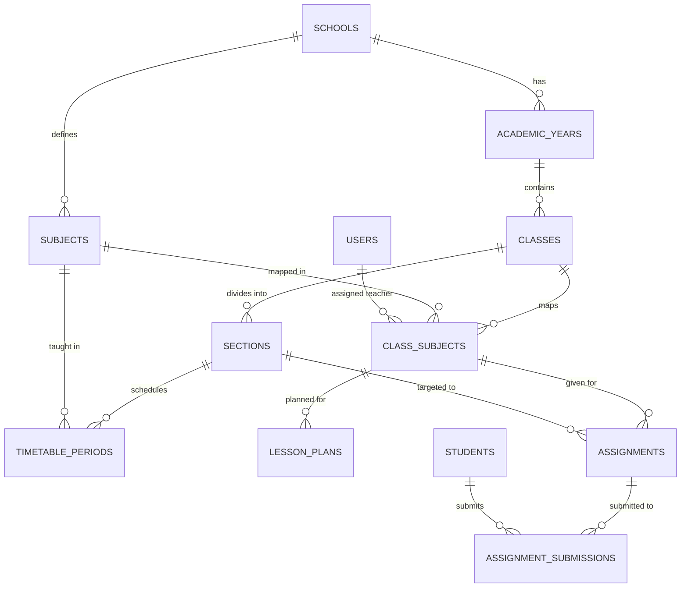

# Comprehensive Deep-Dive Report: Academic Management System (AMS)
**SchoolMitra ERP** — Nursery to Class 10 (CBSE/ICSE/State Board Compliant)

---

## Executive Summary

The **Academic Management System (AMS)** forms the operational spine of SchoolMitra ERP. It connects classes, sections, subjects, teacher allocations, timetables, lesson plans, assignments, student submissions, and grading.

Currently, the system is **Partially Implemented (~45% functional)**:
- **Database Layer**: High-fidelity Drizzle ORM schemas exist for 7 academic entities with multi-tenant isolation, foreign keys, and indexes.
- **Backend Layer**: Next.js Server Actions handle basic CRUD for classrooms, subjects, mappings, timetable slots, assignments, and lesson plans, along with DPDP audit trailing for student mark writes. However, it lacks a dedicated domain service, tRPC router, batch operations, and delete/archive actions.
- **Frontend Layer**: A 6-tab client interface (`/academics`) provides interactive views for Classrooms, Subjects, Subject Mapping, Timetable Grid, Assignments, and Lesson Plans. However, advanced workflows (substitutions, S3 file uploading, syllabus tracking, terms/semesters, batch promotions) are either stubbed or missing.

---

## 1. Database & Data Models (AMS)

The academic module schema is located in [`database/src/schema/academics.ts`](file:///v:/Cascade/Edu_core/Edu_core/database/src/schema/academics.ts), with foundational references in [`database/src/schema/core.ts`](file:///v:/Cascade/Edu_core/Edu_core/database/src/schema/core.ts) and [`database/src/schema/students.ts`](file:///v:/Cascade/Edu_core/Edu_core/database/src/schema/students.ts).

### 1.1 Enums Defined

| Enum Name | Values | Purpose |
|---|---|---|
| `gradeLevelEnum` | `NURSERY`, `LKG`, `UKG`, `CLASS_1` ... `CLASS_10` | Standard K-10 grade levels |
| `subjectTypeEnum` | `THEORY`, `PRACTICAL`, `CO_SCHOLASTIC`, `LANGUAGE`, `ACTIVITY` | Indian curriculum subject classification |
| `periodTypeEnum` | `REGULAR`, `ASSEMBLY`, `BREAK`, `LUNCH`, `LAB`, `PT`, `LIBRARY`, `FREE` | Timetable slot categorization |
| `dayOfWeekEnum` | `MONDAY`, `TUESDAY`, `WEDNESDAY`, `THURSDAY`, `FRIDAY`, `SATURDAY` | 6-day academic work week |
| `assignmentStatusEnum` | `DRAFT`, `PUBLISHED`, `CLOSED`, `GRADED` | Assignment lifecycle states |

### 1.2 Table Specifications



#### Table Breakdown:

1. **`classes`**:
   - **Columns**: `id` (UUID PK), `schoolId` (FK), `academicYearId` (FK), `gradeLevel` (Enum), `displayName` (text, e.g. "Class 6"), `sortOrder` (int), `isActive` (bool), timestamps (`createdAt`, `updatedAt`, `deletedAt`).
   - **Constraints**: Unique constraint on `(schoolId, academicYearId, gradeLevel)`. Index on `(schoolId, academicYearId)`.

2. **`sections`**:
   - **Columns**: `id` (UUID PK), `classId` (FK `classes`), `schoolId` (FK `schools`), `name` (text, e.g. "A", "B"), `capacity` (int default 40), `classTeacherId` (FK `users`), `roomNumber` (text), `isActive` (bool), timestamps.
   - **Constraints**: Unique constraint on `(classId, name)`. Indexes on `classId` and `schoolId`.

3. **`subjects`**:
   - **Columns**: `id` (UUID PK), `schoolId` (FK), `code` (text, e.g. "MATH101"), `name` (text), `nameHindi` (text), `subjectType` (Enum), `maxMarks` (int default 100), `passingMarks` (int default 33), `boardMapping` (text), `isActive` (bool), timestamps.
   - **Constraints**: Unique constraint on `(schoolId, code)`. Index on `schoolId`.

4. **`class_subjects`** (Subject Allocation Master):
   - **Columns**: `id` (UUID PK), `classId` (FK), `subjectId` (FK), `schoolId` (FK), `assignedTeacherId` (FK `users`), `periodsPerWeek` (int default 5), `isElective` (bool default false), timestamps.
   - **Constraints**: Unique constraint on `(classId, subjectId)`. Index on `classId`.

5. **`timetable_periods`**:
   - **Columns**: `id` (UUID PK), `schoolId` (FK), `sectionId` (FK), `academicYearId` (FK), `dayOfWeek` (Enum), `periodNumber` (int 1-8), `startTime` (time), `endTime` (time), `periodType` (Enum), `subjectId` (FK), `teacherId` (FK `users`), `roomNumber` (text), `isActive` (bool), timestamps.
   - **Constraints**: Unique constraint on `(sectionId, dayOfWeek, periodNumber)`. Indexes on `(teacherId, dayOfWeek)` and `(schoolId, academicYearId)`.

6. **`lesson_plans`**:
   - **Columns**: `id` (UUID PK), `schoolId` (FK), `classSubjectId` (FK), `teacherId` (FK `users`), `title` (text), `chapterName` (text), `ncertReference` (text), `objectives` (text), `plannedDate` (timestamptz), `completedDate` (timestamptz), `status` (text: `PLANNED`, `IN_PROGRESS`, `COMPLETED`), `teachingMethods` (text), `resources` (text), `homework` (text), timestamps.

7. **`assignments`**:
   - **Columns**: `id` (UUID PK), `schoolId` (FK), `classSubjectId` (FK), `sectionId` (FK), `createdByTeacherId` (FK `users`), `title` (text), `description` (text), `maxMarks` (int), `dueDate` (timestamptz), `attachmentS3Key` (text), `status` (Enum), `plagiarismCheckEnabled` (bool default false), timestamps.
   - **Constraints**: Indexes on `sectionId`, `schoolId`, and `dueDate`.

8. **`assignment_submissions`**:
   - **Columns**: `id` (UUID PK), `assignmentId` (FK), `studentId` (UUID), `schoolId` (FK), `submittedAt` (timestamptz), `isLate` (bool), `attachmentS3Key` (text), `remarks` (text), `marksAwarded` (int), `gradedByTeacherId` (FK `users`), `gradedAt` (timestamptz), `plagiarismFlagged` (bool default false), timestamps.
   - **Constraints**: Unique constraint on `(assignmentId, studentId)`. Indexes on `assignmentId` and `schoolId`.

---

## 2. Backend & Server Actions (AMS)

Currently located in [`frontend/src/app/(admin)/academics/actions.ts`](file:///v:/Cascade/Edu_core/Edu_core/frontend/src/app/%28admin%29/academics/actions.ts).

### 2.1 Implemented Actions & Permissions

| Action Name | Target Entity | Permitted Roles | Functionality |
|---|---|---|---|
| `getClassrooms()` | `classes` + `sections` | Authenticated | Fetches active classes ordered by `sortOrder` with nested active sections |
| `getTeachersList()` | `users` | Authenticated | Fetches active teachers/users for assignment dropdowns |
| `saveClassroom()` | `classes` | SuperAdmin, Admin, Principal | Creates new class or updates existing; auto-resolves active academic year |
| `saveSection()` | `sections` | SuperAdmin, Admin, Principal | Creates or updates section; assigns class teacher & room |
| `getSubjects()` | `subjects` | Authenticated | Fetches active subjects ordered by name |
| `saveSubject()` | `subjects` | SuperAdmin, Admin, Principal | Creates or updates subject with code, bilingual name, type, marks |
| `getClassSubjectsList()` | `class_subjects` | Authenticated | Fetches subject-to-class mappings with joins to `class` and `subject` |
| `saveClassSubject()` | `class_subjects` | SuperAdmin, Admin, Principal | Creates or updates mapping; assigns default teacher and periods/week |
| `getSectionTimetable()` | `timetable_periods` | Authenticated | Fetches active period slots for a given section |
| `saveTimetablePeriod()` | `timetable_periods` | SuperAdmin, Admin, Principal | Upserts period slot with **Teacher Conflict Detection** |
| `getAssignments()` | `assignments` | Authenticated (scoped) | Fetches assignments; enforces that teachers only view their own mappings |
| `saveAssignment()` | `assignments` | Teacher, Admin, Principal | Creates or updates homework/assignment |
| `getAssignmentSubmissions()` | `assignment_submissions` | Authenticated | Fetches submissions for a given assignment |
| `gradeSubmission()` | `assignment_submissions` | Teacher, Admin, Principal | Updates marks & remarks; **Writes DPDP audit log** |
| `submitAssignment()` | `assignment_submissions` | Student, Parent, Admin | Submits assignment; **Writes DPDP audit log** |
| `getLessonPlans()` | `lesson_plans` | Authenticated | Fetches lesson plans ordered by planned date |
| `saveLessonPlan()` | `lesson_plans` | Teacher, Admin, Principal | Creates or updates plan and status (`PLANNED`/`COMPLETED`) |

---

## 3. Frontend UI & Tab Modules (AMS)

The frontend is housed at [`frontend/src/app/(admin)/academics/`](file:///v:/Cascade/Edu_core/Edu_core/frontend/src/app/%28admin%29/academics/). It renders a responsive 6-tab interface with tab persistence in `localStorage`.

### Tab Breakdown:

```
/academics
├── Tab 1: Classrooms & Sections (ClassroomsTab.tsx)
├── Tab 2: Subject Master (SubjectsTab.tsx)
├── Tab 3: Subject Mapping (SubjectMappingTab.tsx)
├── Tab 4: Timetable Grid (TimetableTab.tsx)
├── Tab 5: Assignments & Grading (AssignmentsTab.tsx)
└── Tab 6: Lesson Plans (LessonPlansTab.tsx)
```

1. **Classrooms & Sections Tab** ([`ClassroomsTab.tsx`](file:///v:/Cascade/Edu_core/Edu_core/frontend/src/app/%28admin%29/academics/ClassroomsTab.tsx)):
   - **What works**: Grid view of classroom cards. Displays sections, capacity, assigned class teacher email, and room number. Modal dialogs for "Add Class" and "Add Section".
   - **Gaps**: No "Edit Class" button on cards. No "Edit Section" button. No delete/archive option. No section capacity fullness indicator (e.g. current enrolled vs max capacity).

2. **Subject Master Tab** ([`SubjectsTab.tsx`](file:///v:/Cascade/Edu_core/Edu_core/frontend/src/app/%28admin%29/academics/SubjectsTab.tsx)):
   - **What works**: Displays subjects list with code, English name, Hindi name, subject type badge, max marks, and passing marks. "Add Subject" modal form.
   - **Gaps**: No edit subject modal wired up from table row. No delete/deactivate button. No NCERT/CBSE chapter reference mapping UI.

3. **Subject Mapping Tab** ([`SubjectMappingTab.tsx`](file:///v:/Cascade/Edu_core/Edu_core/frontend/src/app/%28admin%29/academics/SubjectMappingTab.tsx)):
   - **What works**: Maps subject to a class with periods per week, elective flag, and assigned teacher. "Add Mapping" modal.
   - **Gaps**: Mapping is currently class-wide, not section-specific. No teacher workload counter (e.g. showing how many total periods a teacher has across all classes).

4. **Timetable Grid Tab** ([`TimetableTab.tsx`](file:///v:/Cascade/Edu_core/Edu_core/frontend/src/app/%28admin%29/academics/TimetableTab.tsx)):
   - **What works**: Section switcher dropdown. Weekly matrix (Monday through Saturday, Period 1 through 8). Interactive cell click to assign/edit period slot. Visual badges for period types (Assembly, Break, Lunch, Lab, PT, Library). Double-booking validation alert for teachers.
   - **Gaps**: Hardcoded period times (08:00 - 15:00) and fixed 8 periods. No room conflict detection. No substitute teacher / proxy allocation. No print / PDF export of timetable. No teacher-centric schedule view.

5. **Assignments & Grading Tab** ([`AssignmentsTab.tsx`](file:///v:/Cascade/Edu_core/Edu_core/frontend/src/app/%28admin%29/academics/AssignmentsTab.tsx)):
   - **What works**: Section & Subject mapping selectors. Assignment cards showing due dates, max marks, and status badges. Submission review side panel. Grading modal allowing teachers to enter marks and remarks. Student submission modal.
   - **Gaps**: S3 attachment is just a text field for `attachmentS3Key` instead of an actual file upload picker. No plagiarism check logic. No unsubmitted student tracking list. No bulk grading spreadsheet view.

6. **Lesson Plans Tab** ([`LessonPlansTab.tsx`](file:///v:/Cascade/Edu_core/Edu_core/frontend/src/app/%28admin%29/academics/LessonPlansTab.tsx)):
   - **What works**: Filter by subject mapping. Cards showing chapter name, title, NCERT reference, planned date, and status. One-click "Mark Completed" button. "Create Plan" modal.
   - **Gaps**: No multi-chapter syllabus tree (Units -> Chapters -> Topics). No syllabus progress bar (% completed vs academic calendar elapsed). No principal/coordinator review and sign-off workflow.

---

## 4. Gap Analysis & Missing Workflows

Here is the exhaustive inventory of what is missing or broken in the current implementation:

### 4.1 Missing Submodules

| Submodule | Importance | Current Status | Description |
|---|---|---|---|
| **Academic Terms / Semesters** | **CRITICAL** | **Missing** | No table for Terms (e.g. Term 1, Term 2, Quarterly). Exams and timetables currently cannot be divided into academic terms. |
| **Academic Calendar & Holidays** | **CRITICAL** | **Missing** | No calendar engine defining working days, national/gazetted holidays, vacation breaks, and school event dates. |
| **Section-wise Teacher Allocation** | **HIGH** | **Deficient** | `class_subjects` only maps teacher at Class level, not Section level. Cannot assign Teacher A to 10-A Maths and Teacher B to 10-B Maths. |
| **Proxy / Substitution Management** | **HIGH** | **Missing** | When a teacher takes sick leave, there is no workflow to reassign periods to free teachers for the day. |
| **Syllabus & Curriculum Tracker** | **MEDIUM** | **Missing** | No chapter/topic breakdown to track academic progress against CBSE/ICSE prescribed syllabus. |
| **Student Promotion Engine** | **HIGH** | **Disconnected** | `student_class_history` exists in DB, but AMS has no bulk promotion wizard (e.g. Class 1A -> Class 2A at end of year). |
| **Teacher Schedule View** | **MEDIUM** | **Missing** | Teachers can only see section timetables, not their own consolidated weekly schedule. |
| **File Attachments (S3 Direct)** | **MEDIUM** | **Stubbed** | UI uses raw text input for S3 keys rather than signed URL file uploaders for homework/lesson plan PDFs. |

### 4.2 Missing CRUD Operations

- **Delete/Deactivate**: Zero delete actions exist in `actions.ts`. Cannot delete or soft-delete a class, section, subject, mapping, timetable slot, or lesson plan.
- **Edit Classrooms**: Class card UI lacks an edit trigger button.
- **Search & Filter**: No search bars for subjects, classes, or assignments.

---

## 5. Architectural Recommendations

To make Academic Management enterprise-grade and 100% production ready, we should implement the following phases:

1. **Schema Enhancements**:
   - Add `academic_terms` table (`id`, `schoolId`, `academicYearId`, `name`, `startDate`, `endDate`, `isActive`).
   - Add `school_calendar_events` table (`id`, `schoolId`, `title`, `eventType` [HOLIDAY, EVENT, EXAM, PTM], `startDate`, `endDate`).
   - Add `section_teachers` or enhance `class_subjects` to support Section-level teacher assignments.
   - Add `timetable_substitutions` table for daily proxy teacher assignments.

2. **Backend Domain Service**:
   - Extract AMS business logic into `backend/src/server/services/AcademicsDomainService.ts`.
   - Add full CRUD with soft delete (`deletedAt = new Date()`).
   - Implement room collision detection alongside teacher collision detection.

3. **Frontend Polish**:
   - Add S3 file upload integration for homework and lesson plan attachments.
   - Add Teacher My Timetable view.
   - Add Syllabus Completion Progress Bar to Lesson Plans.
   - Implement daily Substitution / Proxy assignment tab.
