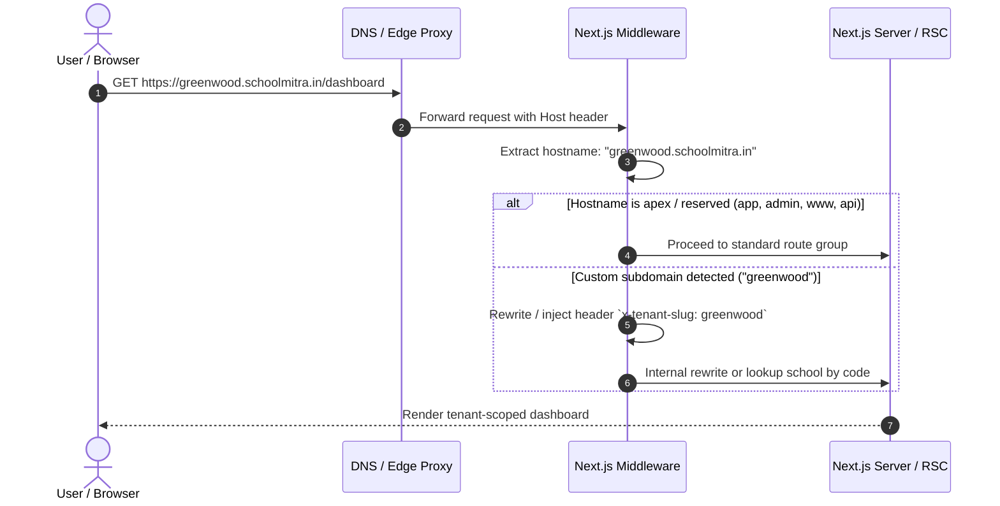

# Subdomain Routing & Multi-Tenant Wildcard DNS Architecture

## 1. Overview
SchoolMitra ERP is architected as a multi-tenant SaaS application where each school institution can be accessed via either:
1. **Subdomain-based tenant routing**: `https://<school-code>.schoolmitra.in`
2. **Path-based tenant session routing**: `https://app.schoolmitra.in` where tenant scope is governed by authenticated session cookie.
3. **Custom domain mapping (Enterprise tier)**: `https://erp.greenwoodhigh.edu.in` via CNAME.

---

## 2. DNS Infrastructure Requirements

### A. Wildcard DNS Record
To allow dynamic tenant onboarding without provisioning individual DNS records for each school:
- **Type**: `CNAME` (or `A` / `ALIAS` depending on apex/subdomain setup)
- **Host / Name**: `*.schoolmitra.in`
- **Target / Value**: `schoolmitra-frontend.onrender.com` (or Cloudflare / AWS CloudFront distribution domain)
- **TTL**: `300` (5 minutes)

### B. SSL/TLS Certificate Provisioning
- An automated wildcard SSL certificate must cover:
  - `schoolmitra.in` (apex)
  - `*.schoolmitra.in` (all school tenants)
- Managed via Cloudflare Universal SSL or Let's Encrypt / AWS Certificate Manager (ACM).

---

## 3. Hostname Resolution & Middleware Flow

In Next.js Edge Middleware (`frontend/src/middleware.ts`):

### Reserved Subdomains
The following subdomains are reserved for core platform operations and never allocated to individual schools:
- `app`: Central login and user portal
- `admin` / `super-admin`: Platform operator administration
- `api`: Dedicated REST / webhook endpoints (e.g. Razorpay webhooks)
- `assets` / `cdn`: Static assets and media CDN
- `docs`: Documentation portal
- `www` / `@`: Public marketing homepage

---

## 4. Tenant Context & Isolation Guarantee
1. **Request Headers**: When a tenant subdomain is accessed, the edge middleware sets `x-tenant-code` in the forwarded request headers.
2. **Session Consistency**:
   - NextAuth session cookies are scoped to domain `.schoolmitra.in` (with `SameSite=Lax`, `Secure=true`).
   - If a user is logged into School A and visits `schoolb.schoolmitra.in`, `requireAuth()` cross-checks the user's `session.user.schoolId` against the active school record for `schoolb`.
   - If there is a mismatch, the user receives an explicit HTTP 403 / redirect to login.
